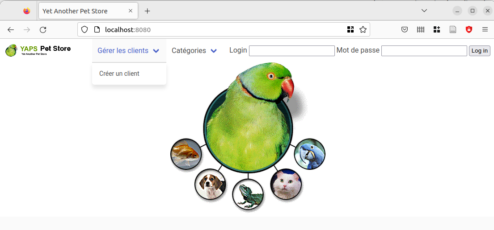
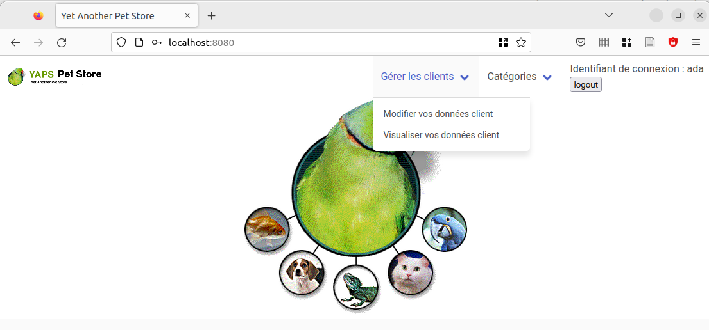
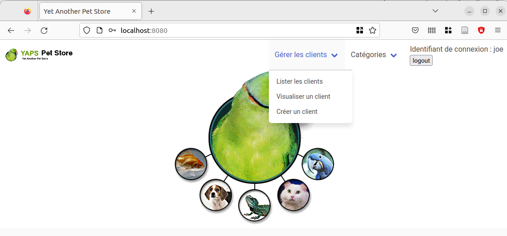
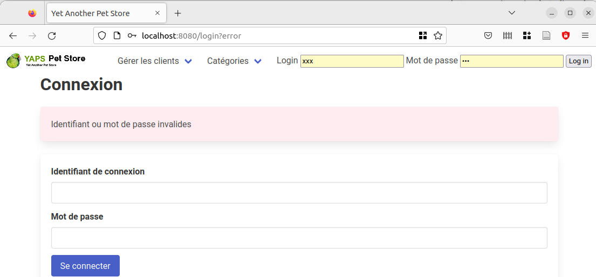
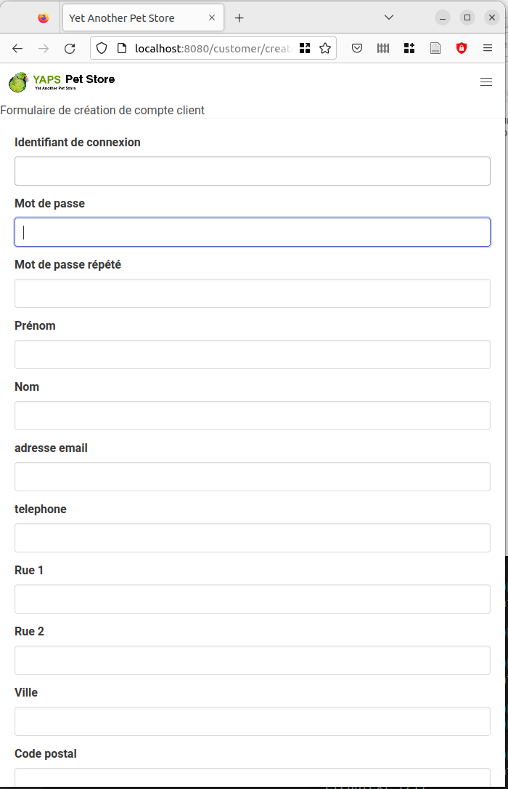
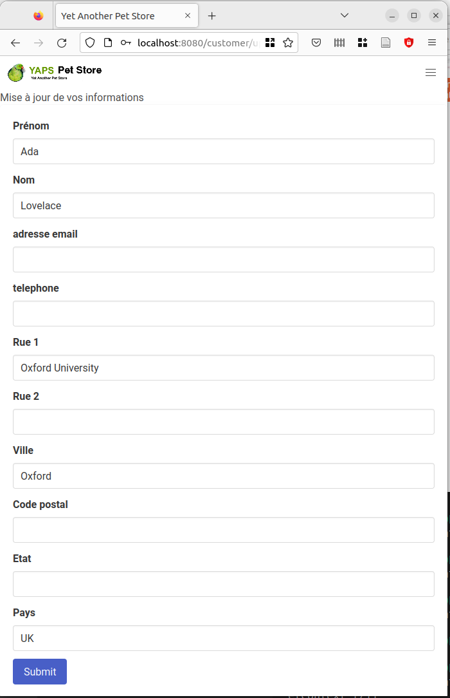

 # TP 9 Spring : Authentification / Sécurité

## Expression des besoins

YAPS se rend compte des bienfaits de l'Internet depuis que ses franchisés l'utilisent. Après réflexion, elle décide de donner accès à son site aux internautes.

Les internautes peuvent consulter le catalogue de la société et, s'ils le désirent, se connecter à l'aide d'un mot de passe et saisir leurs informations ou les mettre à jour : identité et adresse. 
Les franchisés, quant à eux, pourront (dans quelques semaines gérer le catalogue.

### Diagramme de cas d'utilisation

On se limite pour l'instant à ce que l'application web doit pouvoir faire.

~~~plantuml
@startuml
(créer un profil) <-- :employé: 
(visualiser le catalogue) <-- :employé:
(lister les clients) <- :employé: 
(visualiser un client) <-left- :employé:

:client: --> (créer un profil)
:client: --> (visualiser le catalogue)
:client: -left-> (mettre à jour son profil)

@enduml
~~~

####  Créer un profil.

Permet de créer un nouveau profil client.

##### Acteurs
- client ou employé.

##### Pré-conditions

L'utilisateur est un client **non authentifié** ou un Employé.

##### Description

- 1. L'internaute entre les données suivantes :
    - Username : identifiant de connexion (choisi par l'utilisateur)
    - mot de passe de connexion 
    - mot de passe de connexion, une seconde fois
    - First Name : prénom
    - Last Name : nom de famille
    - Telephone : numéro de téléphone où l'on peut joindre le client
    - Email : adresse mail du client
    - Street 1 et Street 2 : ces deux zones permettent de saisir l'adresse du client.
    - City : ville de résidence
    - State : état de résidence 
    - Zipcode : code postal
    - Country : pays de résidence

2. Il envoie les données
3. le système vérifie le formulaire
4. Le système affiche un message de confirmation.

##### Exceptions

- 3.1 les données sont invalides si :
    - l'username est vide ;
    - l'username est utilisé pour un autre **utilisateur** (pas seulement un autre *customer*) ;
    - les deux mots de passent font moins de trois lettres, et ne sont pas identiques ;
    - le champ firstname est vide ;
    - le champ lastname est vide ;
    - le champ mail n'est pas vide, mais ne contient pas un mail.

    Dans ce cas, le formulaire est ré-affiché avec les messages d'erreur correspondant.

    L'utilisateur n'est pas créé.

##### Post-conditions

- les informations de l'internaute sont créées ;
- il dispose maintenant d'un compte.

####  Mettre à jour son profil.

Permet à un **client** enregistré de modifier ses informations.
Le mot de passe n'est pas concerné : on mettra en place un système unifié de mise à jour du mot de passe pour tous les utilisateurs.

##### Acteurs
- Client

##### Pré-condition

Le client s'est authentifié.

##### Description

1. le système présente au client un formulaire contenant ses données ;

2. le client modifie tout ou partie des données suivantes :
    - First Name : prénom
    - Last Name : nom de famille
    - Telephone : numéro de téléphone où l'on peut joindre le client
    - Email : adresse mail du client
    - Street 1 et Street 2 : ces deux zones permettent de saisir l'adresse du client.
    - City : ville de résidence
    - State : état de résidence 
    - Zipcode : code postal
    - Country : pays de résidence

3. Il envoie les données
4. le système vérifie le formulaire
5. Le système affiche un message de confirmation.

##### Exceptions

Voir le cas « Créer son profil » 

En cas d'erreur le formulaire est ré-affiché avec les messages d'erreur correspondant.

Le client n'est pas modifié.

##### Post-conditions

Les informations du client sont mises à jour.

### Ecrans
La page d'accueil de l'application Petstore Web permet aux internautes de visualiser le catalogue mais aussi de s'identifier.

Les menus **présenteront uniquement les opérations possibles**

#### Écran de connexion

La connexion est possible, soit à partir d'une page spécifique (url `/login`), soit sur n'importe quelle page dans l'en-tête.

L'utilisateur non connecté peut se créer un compte.

#### Menu pour un client connecté

#### Menu pour un employé connecté

#### Erreur de connexion

#### Formulaire de création d'un nouveau client

#### Formulaire de mise à jour d'un client

(disponible uniquement pour un client connecté)

### Rôles

La visualisation du catalogue ne nécessite pas d'être authentifié mais deux rôles différents doivent être gérés par l'application lors de l'authentification :
1. Le client (user) peut modifier son compte ;
2. L'employé peut visualiser tous les clients ;

Des utilisateurs sont prédéfinis dans la base et ont tous un mot de passe identique(cnam). Ils permettent de tester les différents rôles en se connectant
avec les login ci-dessous :

1. ada (client)
2. charles (client)
2. joe (rôle franchisé)

## Analyse et conception

### Routage

On a décidé de s'aider du routage pour cacher la partie interdite aux clients. Le préfixe `/office` donne accès à des urls qui seront réservées aux employés.

Les principales urls sont :

- `/` page d'accueil
- `/customer/create` pour créer un nouveau client (GET/POST)
- `/customer/updateself` (GET/POST) pour qu'un client mette à jour ses propres données ;
- `/customer/viewself` (GET) pour qu'un client voie ses données ;
- `/item/view` pour visualiser un item (GET)
- `/product/view` pour visualiser un product (GET)
- `/category/view` pour visualiser un product (GET)
- `/login`...
- `/logout`...
- `/office/customer/list` (GET)
- `/office/customer/search`(GET)
- `/office/customer/view` (GET)

### Modification de la base de données

- on ajoute un champ *username* pour stocker le username (login) (non vide, de longueur maximale 32 caractères);
- on ajoute un champ *password* pour stocker le mot de passe (minimal 3 caractères, maximal 32 caractères);
- on ajoute un champ rôle ; 

Le mot de passe sera stocké *après* application de l'algorithme de hachage. Sa longueur n'aura rien à voir avec sa longueur d'origine. Nous reprenons les valeurs proposées dans le fichier `users.ddl` de Spring et nous choisissons donc une longueur de 500 caractères.

On pourrait représenter les rôles explicitement par une table, mais c'est assez peu utile. On peut en JPA utiliser l'annotation `@Enumerated` avec au choix `EnumType.ORDINAL` (commencent à 0) ou `EnumType.STRING` selon la manière dont on veut stocker l'information (numérique ou chaîne de caractère en clair). On utilisera donc une énumération pour distinguer les rôles possibles.

### Classes

On est d'abord tenté de placer les informations de connexion dans la classe `Customer`, puisqu'un `Customer` pourra se connecter.

Mais à la réflexion, un employé aura aussi cette possibilité ; et même si un employé peut être par ailleurs un client, on aura dans ce cas intérêt à distinguer les deux notions et à créer deux comptes : un employé-comme-client aura un compte `Customer` normal, distinct de son compte employé-comme-employé.

On introduit donc une classe `YapsUser`. Notre modèle de sécurité étant assez simple, nous préférons l'implémenter nous-même plutôt que de passer par les définitions données par Spring pour `JdbcUserDetailsManager`. Pour être cohérent avec la terminologie de l'environnement Java/J2EE/Spring, on emploie son vocabulaire ; plutôt que de *login* nous parlerons de *username*.

Pour simplifier, la clef pour un utilisateur sera son username. On choisit de représenter les rôles par des chaînes de caractères plutôt que par des indices entiers, ce qui est un peu plus lisible.

On pourrait ensuite ajouter quelques informations administratives intéressantes :

- date de dernière connexion ;
- booléen permettant d'indiquer qu'un utilisateur est bloqué ;

On se réserve la possibilité de le faire plus tard.

### Modification de l'architecture du code

On ajoute un package `com.yaps.petstore.security`, qui permet de créer des utilisateurs et de récupérer leurs informations. Il contient en particulier une classe `YapsUserService` qui implémente `UserDetailsService`.

La classe `Customer` est étendue pour qu'on sache à quel utilisateur correspond un `Customer` donné.

L'objet qu'on stocke en base pour représenter un utilisateur est un `YapsUser` ; les rôles possibles (client et employé) sont représentés par un `enum`, `YapsUserRole`.

~~~plantuml
@startuml
package customer {
    package customer.domain {
        class Customer {
            id : String
            user : YapsUser
            ...
        }
    }
}

package security {
    package security.ui {
        class LoginController {}
    }
    package security.service {
        class YapsUserService implements UserDetailsService {
            loadUserByUsername(username)
            createUser(username,password,role)
        }
    }
    package security.domain {
        class YapsUser {
            
        }
        enum YapsUserRole {}
    }
    
    package security.dao {
        interface YapsUserDAO {}
    }
}

customer -[hidden]> security
security.ui ..[hidden]> security.service
security.service -[hidden]> security.domain
security.service --[hidden]> security.dao
Customer::user -> YapsUser
YapsUser -> YapsUserRole
@enduml
~~~

## Implémentation

On a défini une classe `AuthentificationConfig` pour donner les règles d'authentification, et définir un encodeur pour les mots de passe.

Pour se donner plus de souplesse, on utilise un `DelegatingPasswordEncoder` qui permet d'utiliser plusieurs systèmes de codage et de les faire éventuellement évoluer. Les mots de passe initiaux seront fixés en clair, avec l'encodeur `noop`. Ça n'est pas une très bonne idée, mais ça nous permet de montrer la cohabitation de deux systèmes de codage. L'idée est bien évidemment que les utilisateurs mettent à jour leur mot de passe. Le *codage* des nouveaux mots de passe utilisera BCrypt.

On définit aussi une classe `WebSecurityConfig` qui fixe les règles d'accès. Celles-ci seront basées sur les urls.

Le menu du `layout.html` est modifié pour ne donner accès qu'aux opérations possibles.

## À faire

- modifier les règles dans WebSecurityConfig pour vérifier les règles suivantes :
    - seul un utilisateur qui n'est pas un client authentifié (c'est à dire qui est soit un employé soit un utilisateur non connecté) peut créer un client ;
    - seul un client connecté peut mettre à jour ses données ;
    - seul un client connecté peut visualiser ses données (url `/customer/viewself`);
    - seul un employé peut lister, visualiser ou chercher un client ;

- compléter le code pour l'édition de customer :

    - écrivez le formulaire dans `updateself.html` (vous pouvez vous aider du formulaire de création de customer, en vous rappelant que certains champs ne sont plus présents) ;
    - complétez le `CustomerServiceImpl` (c'est très simple, vu que le code est juste commenté) ;
    - complétez `UpdateSelfCustomerDataController` ; attention, il y manque en particulier des annotations de Spring MVC (pas de sécurity). Vous pouvez vous inspirer du contrôleur de création de customer.

N'utilisez pas `antMatchers`, et préférez-lui `mvcMatchers`.

## Recette et tests

Nous avons ajouté des tests sur la sécurité, et modifié certains tests antérieurs pour tenir compte des changements (certaines opérations demandent maintenant d'être connectés).

Par exemple :

~~~java
@Test
@WithMockUser(username = "username1", roles = { "CUST" })
public void testViewSelf() throws Exception {
    mockMvc.perform(get("/customer/viewself")).andExpectAll(
        status().isOk(),
        content().string(
            stringContainsInOrder(
                customer.getFirstname(),
                customer.getLastname(),
                customer.getEmail(),
                customer.getTelephone(),
                customer.getStreet1(),
                customer.getStreet2(),
                customer.getCity(),
                customer.getCountry()
                )));
}
~~~

Vérifie qu'un utilisateur client de nom `username1` peut accéder à ses données.

~~~java
@Test
@WithMockUser(username = "username1", roles = "EMP")
public void testViewSelfErrorForEmp() throws Exception {
    mockMvc.perform(get("/customer/viewself")).andExpectAll(
            status().isForbidden()
    );
}
~~~

Vérifie qu'un employé ne peut utiliser l'URL "viewself" (qui permet à un client de consulter ses propres données).

## Autres points utilisés dans ce TP

### Flyway

Depuis quelques tps, nous avons commencé à utiliser [Flyway](https://flywaydb.org/) pour gérer les évolutions de la base de données. Il s'agit d'un système qui permet *a priori* d'appliquer des mises à jour de manière sélective à une base de données *même si chttps://www.google.com/search?channel=fs&client=ubuntu&q=renvoy%C3%A2t
Dans les précédents TPs, les scripts de création de la base étaient *partiellement* gérés par flyway. Nous avons décidé d'unifier le travail et de faire gérer *l'intégralité* des scripts par ce système. Docker compose se contente simplement de créer une base.

Flyway garde une trace des migrations SQL effectuées dans une base, et n'applique que les migrations non effectuées. Il permet donc de garder un historique précis de l'état de la base. En revanche, si on modifie le contenu d'un script sql déjà utilisé par *flyway*, il faut une intervention assez lourde. L'idée est vraiment que *chaque* modification de la structure de la base correspond à un nouveau fichier sql.

### Sur @Secured et `sec:authorize-url`

Dans ce TP, nous vous demandons d'implémenter les règles de sécurité **essentiellement dans la classe `WebSecurityConfig`**. On n'utilisera pas les annotations `@Secured` ou `@PreAuthorize`, qui sont malgré tout très pratiques.

Une des raisons pour cela est que nous désirons pouvoir utiliser `sec:authorize-url` dans notre code `Thymeleaf`. Or, cette balise ne fonctionne qu'avec les règles mises en place dans `WebSecurityConfig`, et pas avec les annotations.

C'est bien entendu une raison un peu bancale. 

Cependant, il paraît souhaitable de traiter les menus de manière uniforme. le programmeur de la partie `Thymeleaf` ne devrait pas avoir à se demander comment sont implémentées les autorisations, et il serait même souhaitable d'éviter de devoir connaître celles-ci lors de l'écriture des pages `Thymeleaf`.

Donc, si on programme la sécurité en utilisant des approches variées (annotations, règles dans  `WebSecurityConfig`, etc.), il est probablement mieux de proposer un système qui découple la construction des menus de leur affichage.

Nous ne l'avons pas fait, mais l'idée est la suivante : on crée une classe `MenuEntry` :

~~~plantuml
@startuml
class MenuEntry {
    label : String
    url : String
}
@enduml
~~~

Ensuite, *le code de l'application* rempli un (ou plusieurs) objets menus, en tenant compte :

- des droits de l'utilisateur ;
- de ce qu'il peut réaliser à tel ou tel moment.

L'affichage en *Thymeleaf* reçoit enfin un objet `menu`, contenant les `MenuEntries` qu'il n'a plus qu'à afficher sans se poser de question, puisque celles-ci ont été résolues en amont.

Un avantage de cette approche est qu'il gère les actions possibles *en fonction du contexte* en plus de gérer les droits.

## Identifiant, Username et mises à jour

En développant ce TP, une question s'est posée : les `Customers` sont identifiés par un numéro, et celui-ci est différent de leur `username`. Ça n'est pas très gênant dans l'absolu, mais si l'on n'y prend pas garde, cela peut occasionner de beaux trous de sécurité.
Supposons qu'on puisse envoyer une requête de mise à jour avec l'identifiant d'un Customer A et le username d'un Customer B, cela pourrait permettre à un attaquant identifié comme B de modifier les données de A.

Il faut donc que l'identifiant et le username soient validés par le système et non fournis par l'utilisateur. C'est pour cela qu'ils sont absents du formulaire de mise à jour. 

Il se trouve cependant que la requête de mise à jour d'un client (quand c'est lui-même qui la fait) n'a pas besoin de l'identifiant ni de l'`username` de celui-ci, puisqu'on sait justement qui est connecté ; on récupère l'utilisateur connecté en injectant le `Principal` dans le contrôleur, et on peut connaître le *username* grâce à `principal.getName()`.

Il est évidemment facile, connaissant le *userName* ou l'*id* de récupérer le `Customer` correspondant, quand un utilisateur est un client. Cependant, si on veut utiliser l'*id* client dans des règles de type `@PreAuthorize`, le plus simple est de l'ajouter dans l'objet qui sert de `UserDetail`. Il faudrait donc que `YapsUserService.loadUserByUsername` renvoyât un objet d'une classe « maison » qui étendrait `UserDetail` en lui ajoutant un champ *customerId*. On trouvera dans [cette discussion sur stackoverflow](https://stackoverflow.com/questions/20349594/adding-additional-details-to-principal-object-stored-in-spring-security-context) un exemple développé. 

## Les DTOs

### Introduction
À l'origine, le terme *Data Transfert Object* a été utilisé par [Martin Fowler](https://martinfowler.com/eaaCatalog/dataTransferObject.html). Dans le contexte de J2EE, qui utilisait en particulier les *Remote Method Invocations*, les objets composites, quand ils étaient utilisés entre deux machines distantes, étaient coûteux en termes de performances. Les **DTO**, dans ce contexte, étaient des sortes de *résumés* des objets, contenant des informations éventuellement aggrégées.

Dans le contexte de Spring, les entités peuvent difficilement être présentés à la couche UI, en particulier dès qu'on utilise JPA. En effet, on se retrouve à gérer des problèmes de chargement paresseux et de frontières de transactions. Les DTO résolvent le second problème (tout est fait dans le service, qui lui est transactionnel), et permettent de réfléchir plus efficacement au premier problème.

Par ailleurs, d'un point de vue *logique*, disposer d'objets spécifiques comme paramètre d'une requête se défend. Dans le service qui gère les objets `Customers`, l'argument de la méthode `save` n'a pas besoin d'avoir d'identifiant, puisque celui-ci sera justement créé par `save`. 

Dans cette suite de TPs, nous emploierons volontiers le terme DTO pour des objets qui portent les arguments des méthodes qui forment les façades des différentes couches. Ce sont typiquement des objets *anémiques*, avec peu ou pas de logique métier, contrairement aux entités, qui devraient en avoir (même si ça n'est pas toujours le cas).

**Remarque** : nos objets métiers sont généralement les entités au sens JPA du terme. [Certains architectes](https://www.youtube.com/watch?v=p029gSnlnfU), en particulier dans le paradigme de la programmation hexagonale, suggèrent d'utiliser des POJOS en interne pour le cœur de la couche métier, **sans annotations**, et considèrent les entités JPA comme des objets dédiés au transfert vers la couche persistance.

### Les DTOs et l'objet métier `Customer`

Dans notre application, l'objet `Customer` fait partie du modèle (même si pour l'instant nous faisons essentiellement du CRUD).

Les manipulations de la classe `Customer` sont assez nombreuses. Nous avons défini plusieurs **DTO** pour cela :

- `CustomerDTO` est un objet `Customer` tel qu'il est *visualisé* par l'interface ; c'est typiquement la valeur de *retour* des services ;
- `CustomerCreationDTO` est utilisé lors de la *création* d'un `Customer` ; il ne possède en particulier pas d'identifiant ;
- `CustomerUpdateDTO` est utilisé lors des mises à jour. La gestion du mot de passe sera unifiée entre tous les utilisateurs de l'application, et celui-ci n'est donc pas géré dans `CustomerUpdateDTO`. par ailleurs, nous avons décidé d'identifier le `Customer` par son `username` et non par son `id` pour des raisons de sécurité (nous en parlons ailleurs dans ce sujet).

~~~plantuml
@startuml
title les DTO de la couche service
hide empty members

class AbstractBasicCustomerData {}
class AbstractCustomerDataWithUsername {}
class CustomerCreationDTO {
    password
}
class CustomerDTO {
    id
}
class CustomerUpdateDTO {
    
}
class AddressDTO

AbstractBasicCustomerData <|-- AbstractCustomerDataWithUsername

AbstractCustomerDataWithUsername <|-- CustomerCreationDTO
AbstractCustomerDataWithUsername <|-- CustomerDTO
AbstractCustomerDataWithUsername <|-- CustomerUpdateDTO

AbstractBasicCustomerData -> AddressDTO

@enduml
~~~

La couche présentation (ui) a elle aussi ses DTO. Pour l'affichage, on peut utilise souvent directement ceux de la couche service ; quand il s'agit de *formulaires* et de données à saisir, il devient intéressant de créer des objets spécifiques.

Dans notre cas, nous les avons placés dans le package `com.yaps.petstore.customer.ui.forms` :

~~~plantuml
@startuml
title les dto "formulaires"

package com.yaps.petstore.customer.ui.forms {
    class CreateCustomerForm {
        username
        password1
        password2
        ...
    }
    class UpdateCustomerForm {}
}
@enduml
~~~

Pour la classe `CreateCustomerForm`, l'intérêt est évident : dans ce formulaire, il y a deux champs pour le mot de passe, qui est répété.

### Gestion des dtos

Nous commençons à utilise beaucoup de DTO très proches les unes des autres (en particulier pour les `Customers`). Dans cette optique, les évolutions du code sont assez lourdes à gérer. Les propriétés structurantes de `Customer` (l'identifiant, le `username`) ont peu de chance d'être modifiées ; en revanche, il est possible qu'on décide d'ajouter des informations secondaires. Ces informations risquent de se retrouver dans la plupart des DTO que nous utiliserons. Or, le code concernant les DTO est très redondant. Le risque est grand d'oublier de recopier tel ou tel champ, y compris dans les tests (qui deviennent franchement pénibles à écrire). Bref, on aimerait un système qui permette de travailler en se basant sur des conventions simples (par exemple que *par défaut* les champs soient copiés tels quels).

Il existe de nombreux systèmes pour gérer ce problème, par exemple `JMapper` (rapide, mais plus maintenu), `ModelMapper` ou `MapStruct`. 

Une autre solution, structurelle celle-là, est d'éviter l'usage des *setters* pour initialiser les objets. En passant par un constructeur qui initialise *tous* les champs, on est à l'abris des mauvaises surprises (et les IDEs savent les créer automatiquement). Pour éviter notre problème actuel (une liste d'arguments trop longue), une meilleure structuration des objets (comme avec le champ adresse) peut aider, d'autant que les classes comme `AddressDTO` peuvent être partagées par plusieurs DTOs (voire sorties d'une couche particulière, et réutilisées partout où c'est intéressant).

Comme nous le disons dans la classe `AbstractBasicCustomerData`, l'usage que nous faisons de l'héritage pourrait être remplacé par de la délégation.

On pourrait aussi faire évoluer le code en remplaçant certains des arguments, qui sont actuellement des strings, par des classes spécifiques. Si l'on remplace par exemple `String telephone` par `PhoneNumber telephone`, en introduisant une classe spécifique pour le numéro de téléphone, l'appel du constructeur sera un peu plus lourd (il faudra créer cet objet `PhoneNumber`), mais beaucoup plus clair. 

**Dans l'état actuel des choses, nous avons décidé de gérer les DTOs à la main.** La raison principale est qu'au moment où nous nous sommes posés la question, nous avions déjà écrit le code correspondant !

# Un bug subtil avec JPA

Voir la classe Address...
